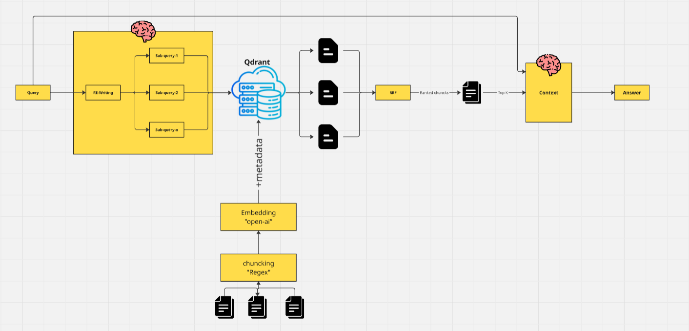
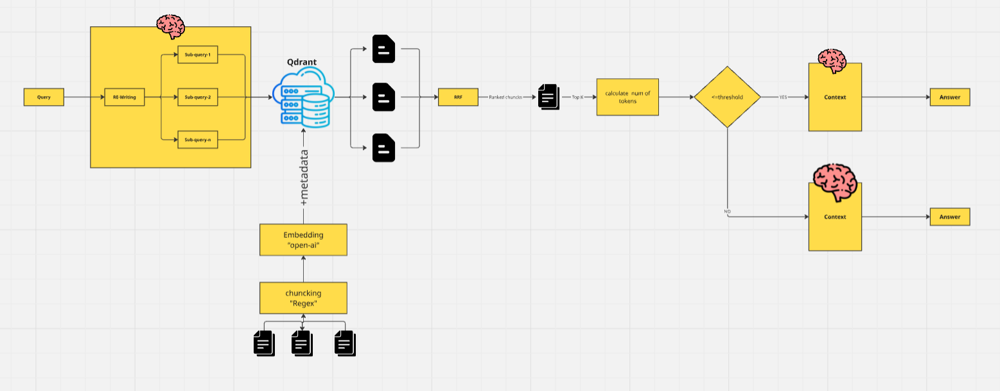
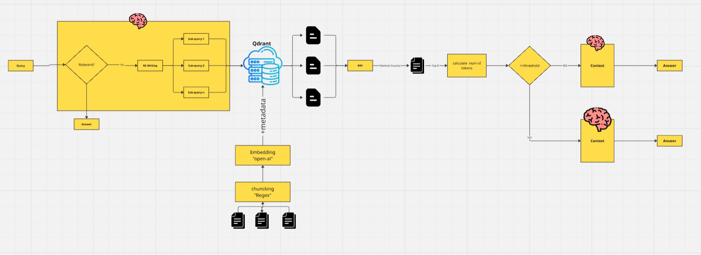

# CV Filtering Chatbot (No Memory RAG)

This is a CV filtering chatbot built with multiple Retrieval-Augmented Generation (RAG) strategies to balance **accuracy**, **cost**, and **latency**. It uses **Qdrant DB** (hosted on cloud) for document storage and retrieval.

The system goes through four evolving stages—from a naive RAG to more advanced, optimized pipelines. Each stage is implemented in a different app file.

---

## 🔧 Prerequisites & Indexing Setup

Before running any of the apps, ensure you have your API keys and Qdrant credentials configured (e.g., as environment variables or in a `.env` file, depending on how the scripts are set up to read them). Then, you must index the CVs:

1.  **Upload CVs**: Place your CVs (PDF format) into the `DB_init/cv_pdfs/` directory.
2.  **Run Indexing Notebook**:
    *   Navigate to the `DB_init/` directory.
    *   Open and run the `indexing_notebook.ipynb` Jupyter Notebook.
    *   This notebook will:
        *   Chunk the PDFs using **Regex**.
        *   Embed the chunks using **`text-embedding-3-small`** from OpenAI (Azure).
        *   Upload the vectors along with their metadata into your **Qdrant Cloud** instance.
    *   Ensure your Qdrant Cloud URL, API key, and collection name are correctly configured within the notebook or your environment.

---

## 📄 `query.py` – RAG Sanity Check

This script is used to perform a basic sanity check to verify that the indexing process was successful and the fundamental RAG pipeline (embedding, retrieval, generation) is working correctly with your Qdrant database.

---

## 🚀 `app.py` – Naive RAG

A simple, foundational RAG system.
-   **Workflow**: Embeds the user query → Retrieves the top-k relevant CV chunks from Qdrant → Passes the query and retrieved chunks to an LLM (e.g., `gpt-4o-mini`) → Generates an answer.
>   This version includes no query rewriting or advanced filtering mechanisms.

---

## 🔄 `app2.py` – Query Rewriting + Fusion

This version enhances retrieval quality by incorporating **semantic query rewriting** and **RAG Fusion**.

### Key Features:
-   An initial LLM call rewrites the original user query into multiple, diverse sub-queries.
-   Each sub-query independently retrieves its top-k relevant chunks from Qdrant.
-   **Reciprocal Rank Fusion (RRF)** is used to re-rank and combine the search results from all sub-queries, improving the relevance of the final context.



---

## 🧠 `app3.py` – Dual-Model Based on Token Length

This stage introduces **dynamic model selection** to optimize for cost and latency based on the length of the generated context.

### Key Features:
-   Calculates the total token count of the combined context (retrieved chunks + query).
-   Dynamically selects the LLM for answer generation:
    -   Uses `gpt-4o-mini` if the total token count is ≤ 16,000.
    -   Uses the more powerful (and expensive) `gpt-4o` if tokens exceed 16,000, to handle larger contexts effectively.
>   This strategy aims to save costs and reduce latency for common queries while reserving a more capable model for complex cases requiring larger contexts, thus maintaining high answer quality.



---

## ✅ `app4.py` – Validation Layer

This version incorporates an **early validation layer** to identify and handle irrelevant queries efficiently, saving computational resources.

### Key Features:
-   An initial LLM call checks if the user's query is relevant to CV filtering or the content of the CV database.
    -   If the query is deemed **irrelevant**, the system responds directly (e.g., "This query is not related to CV filtering.") without proceeding to the RAG pipeline.
    -   If the query is **relevant**, the system continues with the pipeline described in `app3.py` (Query Rewriting, Fusion, Dynamic Model Selection).



---

## 🧪 Models Used

| Task                       | Model Used                               |
|----------------------------|------------------------------------------|
| Embeddings (CV Chunks & Queries) | `text-embedding-3-small` (via Azure OpenAI) |
| RAG QA LLM (Answer Generation) | `gpt-4o`, `gpt-4o-mini` (OpenAI)       |
| Query Rewriting LLM        | `gpt-4o-mini` (OpenAI)                 |
| Query Validation LLM       | `gpt-4o-mini` (OpenAI)                 |

---

## ▶️ How to Run

1.  **Clone the Repository (if you haven't already):**
    ```bash
    git clone https://github.com/mahmoudelwaleed/CV_Filtering_System.git
    cd CV_Filtering_System
    ```

2.  **Set up Environment Variables:**
    Ensure your API keys for OpenAI/Azure OpenAI and Qdrant Cloud (URL, API Key) are set up as environment variables or in a `.env` file that the scripts can access.

3.  **Install Dependencies:**
    Make sure you have Python installed. Then, install the required packages:
    ```bash
    pip install -r requirements.txt
    ```

4.  **Index CVs:**
    Follow the instructions in the "🔧 Prerequisites & Indexing Setup" section above.

5.  **Run any App:**
    You can run any of the Streamlit applications. For example, to run `app2.py`:
    ```bash
    streamlit run app2.py
    ```
    Replace `app2.py` with `app.py`, `app3.py`, `app4.py`, or `query.py` (if `query.py` is also a Streamlit app or adjust command accordingly if it's a simple script `python query.py`).

---
